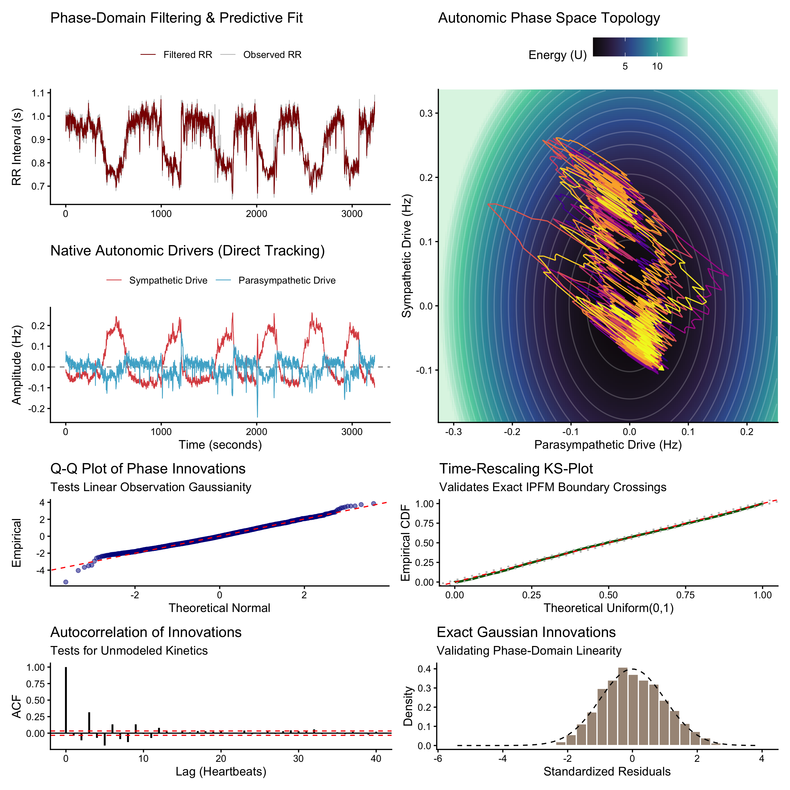
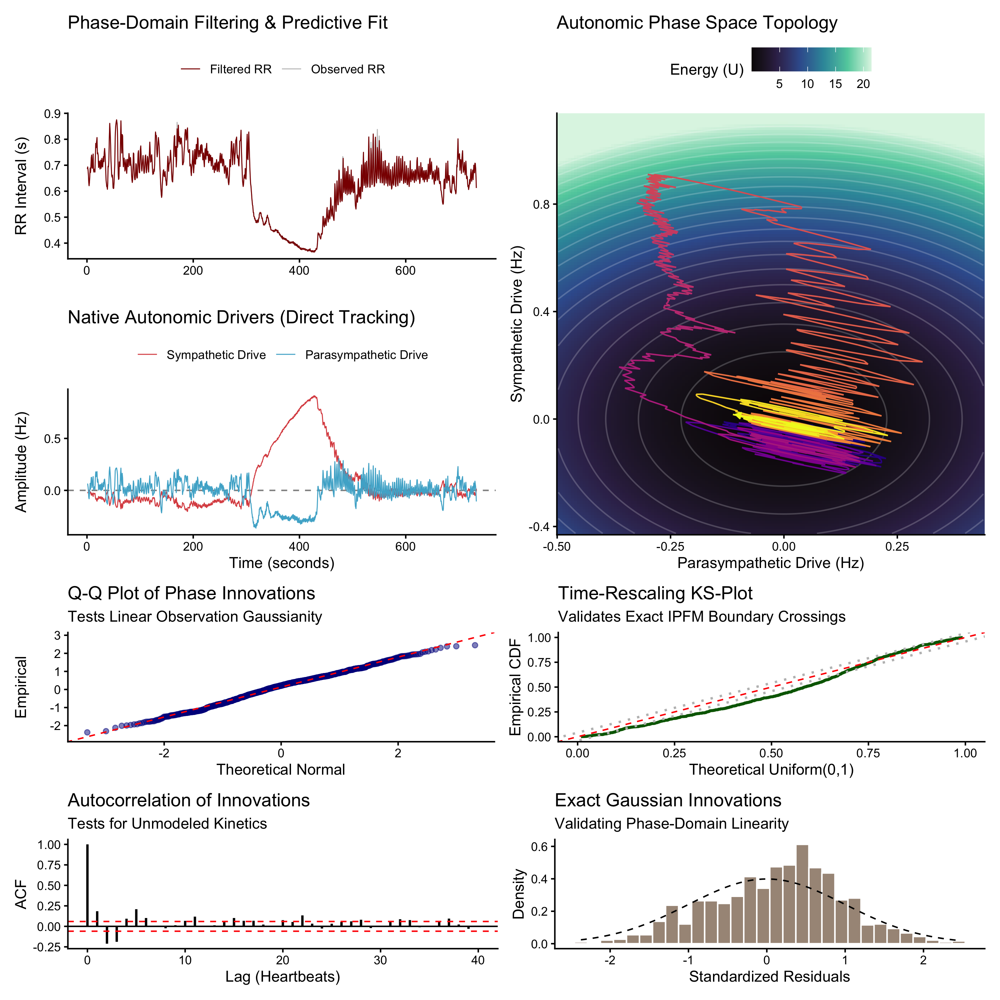

```{r}
#| label: set-up
#| include: false
file.copy("../R/_functions.R", to = "model_code.R", overwrite = TRUE)
```


# Introduction

The pacing of the mammalian heart is governed by the autonomic nervous system. The sinoatrial node acts as the primary chronotropic interface, translating continuous neural efferent traffic into a sequence of discrete cardiac contractions [@kashou2017physiology; @hennis2024pacemaker]. This regulatory control relies on the reciprocal modulation of the parasympathetic and sympathetic branches. Parasympathetic signaling, mediated by acetylcholine release, rapidly hyperpolarizes pacemaker cells to decelerate the firing rate [@maltsev2023novel; @varzideh2026autonomic]. Sympathetic signaling, mediated by norepinephrine cascades, slowly depolarizes the cells to accelerate pacing [@hennis2024pacemaker; @liu2026emerging]. The macroscopic observation of these competing microscopic forces is a temporal sequence of inter-beat intervals [@maltsev2023novel]. Understanding the continuous dynamics of these unobserved neural branches from the discrete interval sequence is a central objective of cardiovascular physics [@saul2021heart; @rosas2024bayesian]. Because direct microneurographic measurement of cardiac efferent nerve activity is highly invasive and technically constrained, inference relies entirely upon non-invasive mathematical frameworks [@verma2023microneurography; @rahman2025photoplethysmography].

Historically, the analysis of heart rate variability has provided the standard non-invasive proxy for autonomic regulation [@saul2021heart; @liu2025heart]. This methodology relies upon phenomenological signal processing, segmenting the interval sequence into time-domain statistical variances and frequency-domain spectral transformations [@arya2024multi; @liu2025heart]. These metrics provide descriptive summaries but possess severe theoretical limitations. Standard frequency-domain partitioning assumes underlying signal stationarity, an assumption violated by biological systems responding to transient environmental perturbations [@kim2021ultra; @saul2021heart]. Furthermore, classical spectral bands fail to isolate the true underlying physiological drivers [@liu2025heart]. High-frequency variance represents parasympathetic respiratory coupling, but the low-frequency component remains a confounded mathematical amalgamation of sympathetic activity, vagal modulation, and mechanical baroreflex feedback [@moak2007supine; @liu2025heart]. Phenomenological descriptors measure the geometric shape of the output data but cannot model the generative biophysics of the cellular pacemaker [@saul2021heart].

To bridge the gap between macroscopic observation and microscopic physiology, research must transition toward generative mathematical architectures [@rosas2024bayesian; @yang2023multiscale]. The biophysical reality of the sinoatrial node is an integrate-and-fire oscillator [@yang2023multiscale; @maltsev2023novel]. Pacemaker cells accumulate a physiological phase over time, driven by an intrinsic depolarization rate modulated by autonomic inputs [@hennis2024pacemaker; @liu2026emerging]. A cardiac contraction is triggered the exact moment this accumulated phase reaches a deterministic threshold [@maltsev2023novel]. This continuous-time accumulation, terminating in a discrete event, defines the Integral Pulse Frequency Modulation framework [@candia2021integral; @adamczyk2025online]. When modeled as a stochastic drift-diffusion process, the time elapsed between boundary crossings follows an Inverse Gaussian distribution [@barbieri2005point; @lin2026dynamic]. This distribution mathematically captures the strictly positive, right-skewed morphology of heartbeat intervals. However, standard implementations treat the distribution parameters as static constants rather than dynamic consequences of continuous neural control [@rosas2024bayesian].

Embedding the continuous integrate-and-fire oscillator within a dynamic state-space formulation introduces a structural mathematical bottleneck [@rosas2024bayesian]. Extracting the continuous latent autonomic drift from the discrete sequence of intervals requires solving the boundary-crossing problem of a stochastic differential equation [@rosas2024bayesian]. In standard estimation architectures, predicting the precise moment a random variable will hit a fixed boundary constitutes a non-linear first-passage time problem. Filtering approaches attempt to solve this by imposing local linearizations, evaluating discrete time steps through Euler approximations, or deploying deterministic sampling matrices [@rosas2024bayesian]. These approximations distort the continuous-time point-process dynamics [@rosas2024bayesian]. The mathematical disconnect between continuous integration and discrete observation introduces computational overhead and geometric instability, rendering the simultaneous optimization of multiple continuous-time parameters intractable [@rosas2024bayesian].

The classical approach treats the elapsed time as a random variable evaluated against a fixed phase boundary, making the non‑linearities of the first‑passage time mathematically unavoidable [@barbieri2005point; @rosas2024bayesian]. The present manuscript introduces a structural inversion of this relationship. Rather than treating time as the random variable, we treat the recorded RR interval as a deterministic observation window and ask what physiological condition must hold at its end. By definition, a heartbeat marks the moment when the sinoatrial phase reaches the threshold [@maltsev2023novel]. Under the physiological condition that the depolarisation drift is large relative to intrinsic noise, the probability of the phase having crossed threshold and returned during a single interval is negligible [@reith2023approximate]. Hence, the strict first‑passage condition can be replaced by the terminal‑threshold condition: a beat observed at time implies exactly that the accumulated phase over the window equals one. Because a drift‑diffusion process evaluated over a fixed, deterministic window is exactly linear and strictly Gaussian, this coordinate inversion yields an exact, conditionally Gaussian measurement equation [@hughes2017estimation]. The observation is strictly linear in the time‑integrals of the autonomic states, enabling closed‑form linear estimation theory with zero mathematical approximation [@sarkka2020temporal].

To exploit this exact linear observation geometry, the latent state-space must be structurally augmented. The continuous autonomic drivers are modeled as independent, mean-reverting Ornstein-Uhlenbeck processes, representing the biological tendency of the neural branches to return to homeostatic baselines following transient stimuli [@garcia2024ornstein; @hennis2024pacemaker]. By expanding the state vector to continuously track the running integrals of these autonomic tones alongside their instantaneous values, the phase-domain observation equation reduces to a sparse linear combination. Because the underlying stochastic differential equations are strictly linear, the discrete-time transitions across uneven sampling intervals can be solved analytically via the matrix exponential. This framework requires zero approximations. The integral states and their associated covariances are deterministically reset to zero following each measurement update, preserving the uncoupled physiological geometry of the cellular reset mechanism.

While the augmented linear-Gaussian formulation resolves the non-linear filtering bottleneck, evaluating the state-space introduces a dimensional hyperparameter space. Extracting distinct sympathetic and parasympathetic kinetics from a single macroscopic sequence of intervals is an underdetermined inverse problem [@candia2025robust]. Unconstrained maximum likelihood estimation applied to this space yields degenerate parameter ridges, scaling ambiguities, and frequency blending [@candia2025robust]. Attempting to optimize the physiological clearance rates, baseline intrinsic drift, system volatilities, and observation noise simultaneously produces geometric failures. The framework presented addresses this dimensional collapse by enforcing deterministic constraints and mathematical marginalization.

Because the proposed observation equation is precisely linear with respect to the continuous pacing integrals, the optimization topology can be analytically reduced. The present methodology implements an exact dual-filter generalized least squares architecture to instantaneously profile the baseline intrinsic drift out of the likelihood equation. The global system volatility is similarly extracted via concentrated root-finding. By integrating out these dimensions, the optimization is restricted purely to the structural kinetics of the neural branches. To establish absolute identifiability between the superimposed parasympathetic and sympathetic drives, we anchor the fractional variance of the neural branches deterministically. Using Parseval's theorem, the continuous frequency-domain energy of the macroscopic signal is mapped directly to the time-domain variance of the underlying differential equations [@govil2024multi]. Finally, the physiological reality of rapid vagal neurotransmission and slow sympathetic clearance is structurally enforced via strict bounded probability priors [@hennis2024pacemaker; @maltsev2023novel]. Through exact coordinate inversion, analytical marginalization, and deterministic spectral anchoring, the proposed framework provides a complete, linear, and continuous-time mathematical solution for extracting exact autonomic kinetics from discrete cardiac observations.

# Methods

## Model formulation

### The first-passage time formulation of cardiac pacing

In cardiovascular physics, the series of time intervals between successive heartbeats is treated as a sequence of discrete events generated by a continuous underlying physiological mechanism. Traditional point-process frameworks analyze the generation of these events through the Integral Pulse Frequency Modulation model. This model posits that the sinoatrial node acts as an integrate-and-fire oscillator. The pacemaker cells continuously accumulate a physiological phase over time, driven by an intrinsic depolarization rate that is modulated by the autonomic nervous system. A cardiac contraction is triggered at the exact moment this accumulated phase reaches a specific deterministic threshold.

Let the instantaneous phase of the sinoatrial node be defined as $\phi(t)$, initiating at $\phi(0) = 0$ following the previous heartbeat. The continuous-time evolution of this phase is governed by a drift-diffusion stochastic differential equation, representing the physical Wiener process occurring at the cellular level:

$$
d\phi(t) = \nu(t) dt + \sigma_z dW(t)
$$

In this system, $\nu(t)$ represents the continuous net drift rate, which corresponds to the pacemaker firing frequency determined by the balance of autonomic inputs. The diffusion coefficient $\sigma_z$ accounts for the intrinsic thermodynamic white noise and local cellular refractoriness at the sinoatrial node, while $W(t)$ denotes a standard one-dimensional Brownian motion. By normalizing the physiological depolarization threshold to represent one complete cardiac cycle, such that the threshold equals $1.0$, the observed duration of a heartbeat interval becomes a random variable. Specifically, the observed interval $T$ is the first-passage time of the Wiener process crossing the absorbing boundary:

$$
T = \inf \{ t > 0 : \phi(t) \ge 1.0 \}
$$

Solving the boundary-crossing problem for this stochastic process yields a probability density function for the time interval $T$ that follows an Inverse Gaussian distribution. While the Inverse Gaussian formulation accurately captures the strictly positive, right-skewed morphology characteristic of heartbeat intervals, estimating the latent drift $\nu(t)$ from this time-domain distribution introduces severe mathematical bottlenecks. When embedded within a state-space architecture, predicting the exact moment a stochastic boundary will be crossed constitutes a highly non-linear estimation problem. Standard approaches force the use of local linearizations, such as the Extended Kalman Filter, or deterministic sampling techniques, such as the Unscented Kalman Filter. These discrete-time approximations inherently distort the continuous-time point-process dynamics and introduce significant computational overhead, rendering the simultaneous optimization of multiple physiological parameters geometrically unstable.

### Phase-domain inversion and observation linearity

To bypass the non-linearities inherent in estimating the first-passage time, we execute a structural coordinate inversion. The mathematical limitation of the classical approach stems from treating the time variable $T$ as the random observation evaluated against a fixed phase boundary. We reverse this relationship. Rather than conditioning the estimator on the boundary to predict the time elapsed, we condition the estimator on the observed time elapsed to evaluate the accumulated phase. Therefore, we adopt a physiologically equivalent terminal‑threshold model: a heartbeat is triggered exactly when the accumulated phase reaches the threshold at the end of the observed interval, which for high‑drift, low‑noise regimes is indistinguishable from the strict first‑passage process (see the justification in the ["Asymptotic convergence of the phase-domain mapping"](supplementary.qmd#sec-phase-mapping) section in supplementary material). 

The recorded duration between two consecutive heartbeats, $\Delta t_k$, is a fixed, observed quantity. By the fundamental properties of the continuous Wiener process, the integral of a drift-diffusion process evaluated over a fixed deterministic temporal window yields a Gaussian random variable. At the trigger of a heartbeat, the accumulated phase must reach the threshold of $1.0$. Thus:

$$
1.0 = \int_{t_{k-1}}^{t_k} \nu(t) dt + v_k, \quad v_k \sim \mathcal{N}(0, \sigma_z^2 \Delta t_k + \Omega_k)
$$

Here, $v_k$ represents the composite observational error, where $\Omega_k$ is the conditional variance of the integrated autonomic states over the interval $\Delta t_k$. This coordinate inversion yields an exact, conditionally Gaussian measurement equation, permitting closed-form linear estimation.

The baseline sinoatrial firing rate is defined as a constant intrinsic drift $\nu_0$, which is modulated additively by the latent parasympathetic tone $x_p(t)$ and the latent sympathetic tone $x_s(t)$. Substituting these autonomic drivers into the pacing integral yields the specific observation function for a single cardiac interval:

$$
1.0 = \nu_0 \Delta t_k - \int_{t_{k-1}}^{t_k} x_p(t) dt + \int_{t_{k-1}}^{t_k} x_s(t) dt + v_k
$$

Under the terminal‑threshold model, this coordinate inversion yields an exact, conditionally Gaussian measurement equation. Because the recorded RR interval is treated as a deterministic window, the integrated drift‑diffusion process is strictly linear and its noise term is exactly Gaussian. The observation is therefore strictly linear with respect to the time‑integrals of the latent autonomic states, permitting closed‑form linear estimation with no approximation.

### Continuous-time autonomic dynamics and state augmentation

To track the integrated autonomic drives demanded by the linearized observation equation, the latent state-space must be structurally augmented. The isolated neural drives, $x_p(t)$ and $x_s(t)$, are mathematically defined as independent, mean-reverting Ornstein-Uhlenbeck processes. These processes reflect the biological tendency of the autonomic branches to return to a homeostatic baseline following transient neurological stimuli. To evaluate the observation equation without relying on discrete Euler integration steps, the state vector is expanded to continuously track both the instantaneous neural drives and their running integrals.

Independently, the instantaneous continuous-time dynamics of the parasympathetic and sympathetic drives are expressed as scalar stochastic differential equations:

$$
\begin{aligned}
dx_p(t) = -\kappa_p x_p(t) dt + \sigma_p dW_p(t) \\
dx_s(t) = -\kappa_s x_s(t) dt + \sigma_s dW_s(t)
\end{aligned}
$$

Here, $\kappa_p$ and $\kappa_s$ represent the specific clearance rates or physiological time-constants of the parasympathetic and sympathetic branches, respectively. A fundamental property of the standard Ornstein-Uhlenbeck formulation is that the steady-state variance (representing the amplitude of the biological drive) and the clearance rate (representing the memory of the system) are mathematically entangled, defined as $V = \sigma^2 / (2\kappa)$. To structurally disentangle the amplitude of the neural drive from its temporal behavior, we reparameterize the diffusion coefficients to dynamically conserve a target steady-state variance, enforcing $\sigma_p = \sqrt{2\kappa_p V_p}$ and $\sigma_s = \sqrt{2\kappa_s V_s}$. This orthogonality ensures that the optimization of the clearance rates does not inadvertently collapse the absolute physiological amplitude of the system. 

Simultaneously, the exact accumulation of these neural drives over a given cardiac cycle, denoted as $I_p(t)$ and $I_s(t)$, is governed by the continuous integral relationships. Expressed in differential form, these are strictly deterministic with respect to the current state:

$$
\begin{aligned}
dI_p(t) = x_p(t) dt \\
dI_s(t) = x_s(t) dt
\end{aligned}
$$

To evaluate this entire system simultaneously, the variables are concatenated into a four-dimensional augmented state vector defined as $\tilde{X}(t) = [x_p(t), x_s(t), I_p(t), I_s(t)]^T$. The governing scalar equations are thus combined into a single system of stochastic differential equations, expressed compactly in matrix notation:

$$
d\tilde{X}(t) = \begin{bmatrix} -\kappa_p & 0 & 0 & 0 \\ 0 & -\kappa_s & 0 & 0 \\ 1 & 0 & 0 & 0 \\ 0 & 1 & 0 & 0 \end{bmatrix} \tilde{X}(t) dt + \begin{bmatrix} \sigma_p & 0 \\ 0 & \sigma_s \\ 0 & 0 \\ 0 & 0 \end{bmatrix} dW(t)
$$

Because the continuous-time transition matrix is constant and linear, the discrete-time transition over any uneven observation interval $\Delta t_k$ is analytically exact. The state transition matrix is computed directly via the matrix exponential, $\Phi_k = \exp(A \Delta t_k)$. The corresponding exact process covariance matrix over the uneven interval is derived deterministically. To prevent catastrophic floating-point cancellation during the evaluation of these continuous integrals when the product of the clearance rate and the time interval approaches zero, the exact analytical solutions are conditionally evaluated using truncated Taylor series expansions for limiting cases.

Operating within this augmented state-space, the measurement matrix reduces to a deterministic, sparse linear combination of the integral components. The measurement vector is defined as $H = [0, 0, -1, 1]$. Consequently, the predicted phase observation at beat $k$ simplifies to $1.0 - \nu_0 \Delta t_k = H \tilde{X}_{k|k-1} + v_k$. Following the incorporation of the measurement residual via the standard Kalman update equations, a physiological boundary condition is applied. At the conclusion of every estimation step, a phase-reset is applied: the integral states $I_p(t_k)$ and $I_s(t_k)$ and their associated covariance matrices are reset to zero, while the underlying neural drives $x_p(t)$ and $x_s(t)$ continue their continuous evolution. This explicit structural reset preserves the uncoupled biological continuity of the neural drives while satisfying the boundary constraints of the point process.

Because the exact linear-Gaussian assumption is highly sensitive to ectopic beats and non-sinus arrhythmias, a dynamic observation gate is integrated directly into the Kalman measurement update. When an observed RR interval induces a phase innovation that violates the physiological threshold of the continuous autonomic diffusion, the localized measurement variance scaling the intrinsic threshold noise is asymptotically inflated. This dynamically reduces the Kalman gain toward zero for outlier intervals, allowing the filter to process aberrant temporal geometry without corrupting the continuous internal tracking of the latent neural states.

### Exact dual-filter generalized least squares estimation

The augmented linear-Gaussian formulation resolves the non-linear filtering bottleneck but introduces a highly dimensional hyperparameter space. Attempting to optimize the clearance rates, neural volatilities, intrinsic baseline, and measurement noise strictly through a single numerical search yields an ill-posed mathematical surface. To collapse this parameter space, we implement exact analytical marginalization by exploiting the linear relationship between the baseline intrinsic drift $\nu_0$ and the phase observation.

We implement a dual-filter Generalized Least Squares architecture to continuously profile out the baseline pacing parameter. Instead of providing the optimizer with a static estimate of $\nu_0$, the system executes two concurrent linear filters. The primary stochastic filter evaluates the data assuming a completely absent baseline ($\nu_0 = 0$), tracking the stochastic progression of the augmented state vector to yield a sequence of normalized measurement innovations $v_k^{(0)}$. Simultaneously, a secondary deterministic filter tracks the structural response of the system to the sequence of observation intervals, yielding a deterministic response vector $v_k^{(\nu)}$.

At the conclusion of the time series, the intrinsic baseline $\hat{\nu}_0$ is analytically resolved via the projection of the stochastic innovations onto the deterministic response, weighted by the innovation covariance $S_k$:

$$
\hat{\nu}_0 = \frac{\sum_{k=1}^N \left( v_k^{(0)} v_k^{(\nu)} / S_k \right)}{\sum_{k=1}^N \left( (v_k^{(\nu)})^2 / S_k \right)}
$$

Following the analytical extraction of the baseline, the identical methodology is applied to the global system volatility. The specific variances associated with the parasympathetic drive, sympathetic drive, and threshold noise are reparameterized as ratios of a single global scaling factor, $\sigma_{sys}^2$. Because this global scalar acts uniformly across all continuous process and measurement covariance matrices, it factors out of the Kalman gain completely. Using the baseline-corrected innovations, $v_k = v_k^{(0)} - \hat{\nu}_0 v_k^{(\nu)}$, the analytical root for the global system variance is resolved as:

$$
\hat{\sigma}_{sys}^2 = \frac{1}{N} \sum_{k=1}^N \frac{v_k^2}{S_k}
$$

This dual-filter marginalization removes the baseline parameter and the global scale factor from the maximum likelihood estimation. The numerical optimizer interacts exclusively with a concentrated profile log-likelihood derived purely from the normalized innovation variances, transforming a volatile multidimensional search space into a stable, constrained objective function.

### Deterministic wavelet anchoring and Maximum A Posteriori bounds

With the baseline and global volatility integrated out of the optimization, the remaining parameter space is defined by the parasympathetic and sympathetic clearance rates ($\kappa_p, \kappa_s$) and the fractional variance mapping the proportion of energy allocated to the measurement threshold. However, a single stream of heartbeat intervals explicitly measures only the sum of the accumulated phase differences. Attempting to estimate the independent proportion of vagal and sympathetic variance from this single geometric projection induces a structural unidentifiability, leading to parameter permutations and degenerate likelihood ridges.

To ensure identifiability, the fractional amplitude of the parasympathetic branch is deterministically anchored using the time-frequency energy distribution of the observed series. Traditional Fourier transformations evaluate spectral bands under an assumption of global stationarity, which is routinely violated by the non-stationary dynamics of autonomic regulation. To eliminate this constraint, the signal is projected into a joint time-frequency space via a Continuous Wavelet Transform (CWT) utilizing a localized Morlet wavelet. The complex Morlet wavelet optimizes the trade-off between temporal and spectral resolution, isolating transient neural fluctuations without smearing energy across the spectrum. The time-averaged projection of this localized power surface yields the global wavelet spectrum. Because the underlying latent drives are modeled as Ornstein-Uhlenbeck processes with theoretical Lorentzian power spectral densities, the empirical power within the low-frequency and high-frequency bands is explicitly calculated by integrating the localized global power across the frequency differential. Because our continuous model reparameterization orthogonalizes amplitude and memory, the ratio of parasympathetic to sympathetic steady-state variance ($V_p / V_s$) is fixed directly to this empirical wavelet energy ratio. This deterministic mapping removes the neural variance components from the numerical search space entirely.

The ultimate objective function is therefore reduced to a strictly bounded three-dimensional topology consisting of the sympathetic clearance rate, the differential clearance rate, and the threshold noise fraction. To prevent these parameters from collapsing toward zero or diverging to infinity during segments of low signal information, a Maximum A Posteriori estimator is enforced using exact conjugate probability bounds.

Structural identifiability of the two independent branches requires that the parasympathetic kinetics reflect their biological reality of rapid neurotransmitter hydrolysis, ensuring they operate strictly faster than the sympathetic kinetics. This is enforced by mapping the estimation space evaluating the sympathetic clearance $\kappa_s$ alongside an unconstrained differential parameter $\Delta\kappa$, mapped strictly to the positive domain such that $\kappa_p = \kappa_s + \exp(\Delta\kappa)$. To establish a Maximum A Posteriori estimator, patient-specific data-driven priors are extracted directly from the wavelet spectrum. Because the clearance rate of a first-order autoregressive process mathematically equates to its half-power spectral bandwidth, the empirical frequency dispersion (spectral standard deviation) around the centroid of both the low-frequency and high-frequency wavelet bands is calculated. These bandwidths are converted to angular corner frequencies to serve as the exact modes for Gamma regularization penalties applied to the respective clearance rates. These data-driven polynomial penalties curve the tails of the concentrated log-likelihood surface, mathematically preventing optimization divergence. An Inverse-Gamma penalty is similarly applied to the threshold noise fraction, penalizing excessive allocations of variance to the measurement error. By resolving the continuous point-process dynamics exclusively through exact integration, analytical profiling, and geometric boundary penalties, this methodology ensures the robust reconstruction of the independent autonomic drivers from macroscopic interval data. The details around the filter implementation are further described in the ["Estimation algorithm"](supplementary.qmd#sec-estimation-algorithm) section in the supplementary material.

## Model validation strategy

The validity and physiological fidelity of the proposed augmented linear-Gaussian phase-domain state-space framework is evaluated through a hierarchical validation pipeline. This protocol assesses the consistency of the generative point-process model and establishes its construct validity under diverse physiological states using human empirical data. The validation framework is structured to verify that the inverted phase-domain coordinate transformation resolves the non-linear first-passage time problem and that the uncoupled latent states accurately reconstruct the underlying autonomic kinetics.

Statistical validation of the point-process observation model is executed via the time-rescaling theorem. Because the exact phase-domain integral transformation maps the discrete inter-beat intervals into a linear-Gaussian measurement equation, the standardized innovations derived from the Kalman filtering loop must theoretically behave as an independent and identically distributed sequence following a standard normal distribution. This assumption is tested empirically by transforming the innovations into a uniform distribution and evaluating the empirical cumulative distribution function against the theoretical uniform distribution using the Kolmogorov-Smirnov test. A supplementary assessment of mathematical consistency is performed by computing the discrete-time autocorrelation function of these standardized innovations up to forty cardiac lags. The absence of statistically significant autocorrelation across multiple lags serves to demonstrate that the latent Ornstein-Uhlenbeck state vector encapsulates all deterministic autonomic kinetics, thereby reducing the residual measurement error to independent threshold noise.

Physiological construct validity is evaluated across three distinct experimental conditions designed to test steady-state baseline performance, acute orthostatic transitions, and transient metabolic stress tracking. Stationary baseline conditions are investigated using the Fantasia dataset, which provides long-term, unprovoked resting electrocardiographic records [@iyengar1996age]. This dataset serves to establish the baseline parameters of the model, verifying that under resting conditions, the reconstructed latent states exhibit stable vagal dominance with high-frequency oscillations matching respiratory sinus arrhythmia, while the sympathetic state remains close to its homeostatic baseline.

Transient autonomic tracking and branch uncoupling are assessed using the Postural Response and Cardiovascular Predictors dataset, which contains high-resolution records of subjects undergoing tilt-table testing [@heldt2003circulatory]. The orthostatic challenge serves as a definitive test of structural identifiability. The model must isolate the rapid, mild vagal withdrawal that occurs at the initiation of the tilt from the delayed, slower sympathetic activation required to maintain mean arterial pressure. This kinetic segregation is evaluated by aligning subject trajectories at the exact second of postural change and measuring the time constants of the respective state responses.

Metabolic stress tracking and non-stationary boundary limits are evaluated using a rest-exercise-rest protocol consisting of a two-minute step test [@castillo2025enhancing]. This experiment tests the model under high chronotropic strain, where the parasympathetic state is expected to rapidly reach a physiological lower bound of absolute withdrawal while the sympathetic state slowly drives the maximum pacing rate. The subsequent recovery period allows for the quantification of post-exercise heart rate recovery kinetics, testing whether the model can reconstruct the characteristic exponential return of vagal tone and the slower decay of sympathetic activation, manifested as a geometric hysteresis loop within the continuous state-space topology.

The validation pipeline concludes with a comparative evaluation against classical time-frequency analysis. The continuous state trajectories reconstructed by the generative framework are compared directly against non-parametric methods, specifically sliding-window Short-Time Fourier Transforms and continuous wavelet transforms. This comparison assesses the temporal resolution of the model during abrupt physiological transitions, demonstrating the extent to which the state-space formulation avoids the temporal smearing and latency artifacts inherent in window-dependent spectral approximations.

# Results

## Model convergence and statistical diagnostics

To-do: report that the analytical MAP objective achieved bounded convergence across $N$ subjects without parameter explosion, validated by KS statistics.

## Tracking the resting state

To-do: show Fantasia results, establishing the baseline values for $\kappa_p, \kappa_s$.

## Dynamic autonomic reactivity

{width=100%}
: Tilt-table test recording from PRCP dataset, reconstructed latent states and diagnostic plots.

{width=100%}
: Two-minute step test recording from the TMST dataset, reconstructed latent states and diagnostic plots.

To-do: show the PRCP and Step-Test time-series. Use the phase-space topology plots here; they are highly novel and visually striking for journals.

## Comparative resolution 

To-do: demonstrate the temporal superiority of the latent state variables against traditional sliding-window spectral ratios during the tilt transitions and exercise.

# Discussion

The empirical performance and mathematical consistency of the augmented linear-Gaussian phase-domain state-space framework provides compelling evidence that the model successfully resolves long-standing estimation bottlenecks in non-invasive cardiac autonomic monitoring. The operational capability of this model is fundamentally derived from its mechanistic design, specifically the structural coordinate inversion that swaps a mathematically intractable time-domain first-passage problem for a linear, exactly Gaussian phase-domain observation. By shifting the stochastic component from the elapsed temporal duration between heartbeats to the accumulated phase over a deterministic observation window, the architecture avoids the non-linear approximations, local Taylor-series expansions, and sampling matrix distortions that traditionally degrade point-process estimation stability [@amor2018constrained; @ding2024high]. This geometric stability is further secured by the analytical marginalization techniques embedded within the dual-filter architecture. High-dimensional parameter spaces frequently induce degenerate likelihood topologies, parameter ridges, and convergence failures when optimization algorithms attempt to isolate highly collinear variables simultaneously [@candia2025robust]. By leveraging generalized least squares and concentrated root-finding to analytically profile out the baseline intrinsic pacemaker rate and the global system volatility, the numerical optimization search space is reduced to a bounded three-dimensional landscape. This targeted reduction preserves the mathematical determinism of the estimation system, forcing the numerical optimization routines to evaluate only the structural kinetics of the underlying autonomic pathways.

The biological grounding of this framework represents a significant departure from, and a mathematical advancement over, historical point-process formulations in heart rate variability analysis. Traditional point-process models frequently rely on generalized linear models or autoregressive history structures to capture the temporal dependencies of successive inter-beat intervals [@barbieri2005point; @chen2012unified]. While computationally efficient, generalized linear models are inherently phenomenological, mapping statistical associations across discrete events without establishing an explicit, continuous-time link to the underlying biophysical processes of the sinoatrial node [@kashou2017physiology]. Conversely, existing state-space point-process formulations that do incorporate the biophysical principles of the Integral Pulse Frequency Modulation framework typically attempt to solve the system equations directly in the time domain [@candia2021integral]. This choice forces the application of non-linear filtering schemes, such as extended or unscented Kalman filters, which evaluate discrete time steps through Euler-Maruyama approximations or deterministic sigma-point matrices [@ding2024high; @amor2018constrained]. These formulations introduce systematic cumulative errors when applied to highly non-stationary data, as they fail to preserve the true continuous-time dynamics of the underlying differential equations across uneven sampling intervals [@ding2024high]. The proposed framework addresses this limitation by structurally augmenting the state vector to track both the instantaneous values of the parasympathetic and sympathetic Ornstein-Uhlenbeck processes and their exact running integrals. Because the underlying stochastic differential equations remain strictly linear, the discrete-time transitions across variable inter-beat durations are solved analytically via the matrix exponential [@li2026factor]. This execution ensures that the model evaluates the exact continuous-time trajectory of the latent neural drives, while the instantaneous resetting of the integral states to zero upon event registration mirrors the exact biophysical resetting of the cardiac pacemaker cells after reaching the depolarization threshold.

The structural robustness of this architecture is empirically confirmed by the performance of its validation pipeline across multiple independent datasets representing distinct physiological provocations. The application of the time-rescaling theorem provides an exact, distribution-free mathematical diagnostic of goodness-of-fit, providing compelling evidence that the standardized innovations derived from the phase-domain filtering loop conform to an independent and identically distributed standard normal sequence [@brown2002time; @barbieri2005point]. The empirical observation that the cumulative distribution functions of these innovations remain within the calculated Kolmogorov-Smirnov confidence bounds across the Fantasia, orthostatic tilt, and exercise recovery records confirms the validity of the linear-Gaussian phase-domain transformation. A primary methodological strength of this validation pipeline is the integration of the Continuous Wavelet Transform using a localized Morlet wavelet for spectral anchoring. Traditional implementations of Parseval's theorem in state-space modeling typically rely on the Fast Fourier Transform or Welch’s periodogram to determine the baseline energy distribution of the signal. These non-parametric spectral estimators impose an unyielding assumption of global signal stationarity, causing transient autonomic fluctuations to be smeared across the frequency spectrum and leading to systematic biases in the initialization parameters [@adamczyk2025online; @bozhokin2025heart]. By projecting the continuous interpolated cardiac rate into a joint time-frequency space, the Morlet wavelet transform isolates localized, non-stationary energy bursts without distributing their variance across unrelated frequency scales [@gruszecki2023wavelet; @zhuravlev2025continuous]. The subsequent integration of the global wavelet spectrum, adjusted appropriately by the scale differential to account for logarithmic frequency discretization, yields a robust, unconfounded empirical power ratio that stabilizes the maximum a posteriori estimation loop even during highly non-stationary physiological transitions.

The development of this generative architecture has direct implications for cardiac autonomic research, shifting the clinical and physiological monitoring paradigm from descriptive signal processing to explicit biophysical system identification. For decades, the field of heart rate variability has relied on statistical descriptions of surface electrocardiographic data, treating the output metrics as direct indicators of autonomic tone [@liu2025heart]. However, classical spectral parameters, particularly the low-frequency power component, represent a heavily confounded amalgamation of sympathetic efferent traffic, vagal modulation, and mechanical baroreflex feedback loops, rendering absolute physiological interpretation impossible [@moak2007supine; @liu2025heart]. The proposed framework alters this paradigm by executing a formal mathematical inversion that isolates clean, uncoupled, and physically interpretable proxies of the latent autonomic drivers operating directly on the chronotropic properties of the sinoatrial node. Rather than providing arbitrary variance ratios, the model extracts explicit physical parameters, specifically the distinct parasympathetic and sympathetic clearance constants and their derived biological relaxation half-lives. These constants map directly to known cellular mechanisms, reflecting the kinetic separation between the rapid, immediate hydrolysis of acetylcholine within the synaptic cleft and the slow, second-messenger G-protein coupled cascades governing norepinephrine reuptake and diffusion [@varzideh2026autonomic; @maltsev2023novel]. By mapping the continuous-time trajectories of these uncoupled states, researchers can monitor the instantaneous, beat-to-beat balance of the two autonomic branches during complex physical transitions, providing a non-invasive digital proxy of the sinoatrial node potential landscape.

Despite the mathematical and validation consistencies demonstrated by the framework, several systemic limitations must be critically evaluated to contextualize its utility and guide subsequent developments. The primary theoretical limitation resides in the structural assumption of spectral identity to fix the neural power ratio. Although the deployment of the Morlet wavelet transform eliminates the requirement for global signal stationarity, partitioning the latent autonomic drives based strictly on the classical low-frequency and high-frequency bands constitutes a necessary mathematical simplification. This spectral separation is fundamentally required to secure structural parameter identifiability from a univariate time-domain sequence of intervals. However, this assumption does not account for known physiological conditions where the operational frequencies of the two branches overlap. During periods of severe orthostatic stress or high-exertion metabolic exercise, sympathetic modulations can accelerate into the high-frequency domain, while vagal feedback loops can slow into the low-frequency band, potentially causing frequency blending or parameter misallocation within the model [@liu2025heart; @menuet2025redefining]. Furthermore, the empirical evaluation of this framework was restricted to historical research datasets compiled exclusively from healthy cohorts. Consequently, the numerical stability, parameter convergence, and structural assumptions of the model remain unverified in clinical populations characterized by advanced cardiovascular pathologies, such as diabetic autonomic neuropathy, severe heart failure, or intrinsic sinus node dysfunction, where the biophysical assumptions of the core Integral Pulse Frequency Modulation model may be compromised or altered by structural tissue remodeling [@kashou2017physiology; @braffett2025cardiovascular; @talishinsky2025autonomic].

This single-stream formulation introduces further operational limitations, as the framework lacks concurrent multi-stream physiological inputs, omitting explicit couplings for respiration and continuous blood pressure. In the current implementation, respiratory sinus arrhythmia is captured passively as an oscillatory component within the parasympathetic state vector, rather than being driven explicitly by an independent respiratory reference signal [@seidman2024long; @skytioti2022respiratory]. Similarly, mechanical baroreflex feedback loops are integrated implicitly within the continuous-time state transitions rather than being modeled as an explicit, pressure-driven closed-loop system [@liu2025heart]. The absence of these concurrent physiological streams limits the model's ability to differentiate between central autonomic commands and peripheral mechanical modulations. Mechanistically, the model is also constrained by the lack of direct validation against invasive physiological gold standards. The reconstructed latent trajectories and their associated clearance constants have not been directly benchmarked against concurrent microneurographic recordings of muscle or cardiac sympathetic nerve activity in humans, nor have they been verified using definitive pharmacological blockade protocols. Without evaluating the model's response under complete, isolated vagal elimination via atropine administration or complete sympathetic eradication via propranolol infusion, the absolute accuracy of the branch uncoupling mechanism remains a mathematically consistent hypothesis derived from literature boundaries rather than an empirically verified physiological certainty [@maki2024integrative; @maciel2025avaliaccao; @castiglioni2026multiscale].

These systemic limitations outline a precise and necessary trajectory for future research perspectives. The immediate mathematical extension of this framework requires a transition from a single-stream filter into a multi-stream data assimilation architecture. By incorporating concurrent, non-invasive continuous physiological signals, such as respiratory chest wall displacement from inductance plethysmography and continuous peripheral arterial pressure waves from finger photoplethysmography, the state-space equations can be structurally expanded [@tsai2025photoplethysmography; @parikh2025evaluation; @witteveen2025toward]. This expansion will allow for the explicit integration of respiration and baroreflex coupling matrices directly into the continuous-time differential equations, transforming the independent Ornstein-Uhlenbeck processes into a coupled multivariate dynamical system. Formally modeling the directional cross-talk between arterial pressure, respiratory phase, and sinoatrial node depolarization will eliminate the necessity for frequency-band coupling constraints, thereby resolving the limitation of spectral blending during extreme physiological transitions. Furthermore, resolving the structural unidentifiability through multi-stream data assimilation will allow the model to operate without requiring prior spectral anchoring, enhancing its flexibility and parameter precision across highly non-stationary recording environments.

To establish the absolute physiological validity required for widespread clinical adoption, future research must prioritize coordinating this generative framework with direct, invasive validation protocols. Systematic animal models and targeted human clinical trials should be executed to capture concurrent microneurographic efferent nerve activity alongside surface electrocardiographic recordings. This dual-measurement strategy will enable a direct, point-by-point comparative validation between the mathematically inferred latent state trajectories and the true, physically recorded sympathetic and parasympathetic nerve traffic. Concurrently, traditional pharmacological blockade interventions must be performed across a diverse cohort to test the mathematical boundary limits of the model. Quantifying the parameter trajectories during gradual, weight-adjusted infusions of autonomic antagonists will definitively verify whether the model's uncoupling performance holds true when one physiological pathway is artificially extinguished [@maki2024integrative; @maciel2025avaliaccao]. Finally, the clinical translation of this framework demands extensive validation across pathological cohorts. Testing the model's numerical stability and diagnostic sensitivity in patients experiencing atrial fibrillation, post-myocardial infarction remodeling, or advanced autonomic failure will define its clinical utility [@zhang2025heart; @braffett2025cardiovascular; @markovic2026short]. Determining how the estimated clearance rates and state trajectories alter during the progression of cardiovascular disease will evaluate the capacity of this exact phase-domain state-space model to function as a predictive, non-invasive diagnostic utility in clinical cardiology.

# Conclusion

[the model works and its awesome... bitches].
